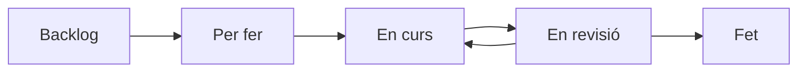

  

<h1 align="center">Projecte 1 · Metodologia Kanban</h1>

<h2 align="center">Del caos al resultat només hi ha un camí: mètode</h2>

  
  
  
  

---

## Índex

1. [Resum visual de l’activitat](#resum-visual-de-lactivitat)  
2. [Objectiu de l’activitat](#1-objectiu-de-lactivitat)  
3. [Ús del metaprompt](#2-qui-ha-dutilitzar-el-metaprompt)  
4. [Conversa amb la IA](#3-què-heu-de-fer-amb-la-conversa-amb-la-ia)  
5. [Product Backlog](#5-product-backlog)  
6. [Microsoft Planner](#6-creació-del-tauler-a-microsoft-planner)  
7. [Simulació de 15 dies](#7-simulació-del-projecte-durant-15-dies)  
8. [Captures obligatòries](#8-captures-de-pantalla-obligatòries)  
9. [Presentació final](#9-presentació-final)  
10. [Entregables](#10-entregables-finals)  
11. [Aspectes que es valoraran](#11-aspectes-que-es-valoraran)  

---

## Resum visual de l’activitat

| Aspecte | Què heu de fer |
|---|---|
| **Projecte** | Crear una empresa fictícia i una idea d’app |
| **Metodologia** | Organitzar el projecte amb Kanban |
| **Eina principal** | Microsoft Planner |
| **Durada simulada** | 15 dies |
| **Product Backlog** | Entre 25 i 30 tasques |
| **Grups** | 2 o 3 alumnes |
| **Entrega principal** | Presentació feta amb Canva o similar |
| **Evidències** | Captures de pantalla del Planner i conversa amb la IA |

> [!IMPORTANT]  
> Aquesta activitat **no consisteix a desenvolupar realment una app**.  
> L’objectiu és crear, organitzar, simular i documentar un projecte amb metodologia Kanban.

> [!WARNING]  
> No serveix crear totes les tasques i posar-les directament a **Fet**.  
> El vostre Planner ha de mostrar una evolució realista durant els 15 dies simulats.

---

## 1. Objectiu de l’activitat

Aquest document explica com heu d’utilitzar el metaprompt d’**Eloy Merlín** per crear un projecte fictici, generar un Product Backlog i simular-ne la gestió amb metodologia Kanban a **Microsoft Planner**.

L’objectiu principal **no és desenvolupar realment l’aplicació**, sinó aprendre a planificar, organitzar, assignar, simular i documentar un projecte com ho faria un equip de treball.

En aquesta activitat creareu un projecte fictici format per:

- Una empresa inventada.
- Una idea de logotip.
- Una proposta d’aplicació que es podria fer amb App Inventor.
- Un Product Backlog d’entre 25 i 30 tasques.
- Un tauler Kanban a Microsoft Planner.
- Una simulació de l’evolució del projecte durant 15 dies.
- Una presentació final amb captures de pantalla del procés.

El més important és demostrar que enteneu com funciona la metodologia Kanban i com es pot utilitzar Microsoft Planner per gestionar un projecte.

---

## 2. Qui ha d’utilitzar el metaprompt?

En aquest [enllaç tens el metaprompt](./Generació_product_backlog.md) que heu d’utilitzar per generar el Product Backlog fictici del projecte.

**Còpia i enganxa el codi del metaprompt en una eina generativa d’IA.**

Només cal que **un alumne del grup** introdueixi el metaprompt a la IA.

Aquest alumne serà l’encarregat de mantenir la conversa amb l’assistent Eloy Merlín, però les respostes s’han de decidir entre tots els membres del grup.

Encara que només una persona escrigui a la IA, el projecte és de tot el grup.

### Abans de començar, comproveu això

- [ ] El grup té 2 o 3 membres.
- [ ] Heu decidit qui escriurà a la IA.
- [ ] Tothom participarà en les decisions.
- [ ] Teniu accés a Microsoft Planner.
- [ ] Teniu clar que l’app és només una proposta fictícia.
- [ ] Guardareu la conversa amb la IA com a evidència.

---

## 3. Què heu de fer amb la conversa amb la IA?

Heu de guardar la conversa completa amb la IA.

Aquesta conversa és una evidència del procés de treball i pot servir per justificar:

- Com heu definit l’empresa.
- Com heu triat la idea del projecte.
- Com s’ha generat el Product Backlog.
- Com s’han assignat les tasques.
- Com s’ha plantejat la simulació dels 15 dies.
- Quines decisions heu pres com a grup.

Podeu guardar la conversa fent captures de pantalla, exportant-la o copiant-la en un document, segons indiqui el professorat.

> [!TIP]  
> No es tracta de copiar sense pensar. La IA us dona una proposta, però el grup ha de revisar-la, adaptar-la i portar-la manualment al Planner.

---

## 4. Ús del metaprompt

Heu de copiar el metaprompt facilitat pel professorat i enganxar-lo en una conversa amb la IA.

L’assistent actuarà com a **Eloy Merlín**, un assessor de negocis i mentor tecnològic amb un estil directe, enginyós i professional.

L’assistent us farà preguntes sobre:

- Els membres del grup.
- Els vostres interessos.
- La data d’inici fictícia del projecte.
- El tipus d’empresa que voleu crear.
- La idea del logotip.
- La proposta d’app.
- Les tasques que formaran part del Product Backlog.
- La simulació del projecte durant 15 dies.

No heu de respondre a l’atzar. Les respostes han de ser acordades pel grup.

---

## 5. Product Backlog

El resultat principal de la conversa amb la IA serà un **Product Backlog fictici** d’entre 25 i 30 tasques.

Aquest Product Backlog haurà d’incloure tasques relacionades amb:

- Organització de l’equip.
- Creació del tauler a Planner.
- Definició de l’empresa fictícia.
- Concepte del logotip.
- Proposta d’app amb App Inventor.
- Simulació del procés Kanban.
- Documentació del projecte.
- Preparació de la presentació final.

Cada tasca haurà de tenir, com a mínim:

| Camp de la tasca | Què ha d’incloure |
|---|---|
| **Títol** | Nom curt i clar de la tasca |
| **Descripció** | Explicació concreta del que s’ha de fer o simular |
| **Responsable** | Alumne o alumnes assignats |
| **Prioritat** | Alta, mitjana o baixa |
| **Categoria** | Tipus de tasca |
| **Dates** | Inici i venciment recomanats |
| **Checklist interna** | Petits passos dins la tasca |
| **Criteri d’acceptació** | Condició per considerar-la acabada |
| **Evidència** | Captura, document o justificació que demostra la feina |

### Categories recomanades

| Categoria | Exemple de tasques |
|---|---|
| **Empresa i estratègia** | Nom, missió, públic objectiu |
| **Identitat visual** | Logotip, colors, tipografia |
| **Planificació Kanban** | Buckets, etiquetes, responsables |
| **App Inventor conceptual** | Pantalles, funcionalitats, components |
| **Simulació del projecte** | Moviment de tasques i incidències |
| **Documentació** | Captures, conversa amb IA, justificacions |
| **Presentació final** | Canva, conclusions, enllaç al Planner |
| **Revisió i qualitat** | Correccions, validació i coherència |

---

## 6. Creació del tauler a Microsoft Planner

Quan tingueu el Product Backlog generat, haureu de crear manualment el projecte a **Microsoft Planner**.

No n’hi ha prou amb tenir la resposta de la IA. Heu de portar les tasques al Planner i organitzar-les correctament.

El tauler haurà de tenir, com a mínim, aquestes columnes:

| Columna | Significat |
|---|---|
| **Backlog** | Tasques previstes però encara no activades |
| **Per fer** | Tasques que començaran aviat |
| **En curs** | Tasques que s’estan treballant |
| **En revisió** | Tasques acabades però pendents de validar |
| **Fet** | Tasques finalitzades i documentades |

També haureu d’utilitzar categories o etiquetes per diferenciar els tipus de tasques. Per exemple:

- Empresa i estratègia.
- Identitat visual.
- Planificació Kanban.
- App Inventor conceptual.
- Simulació del projecte.
- Documentació.
- Presentació final.
- Revisió i qualitat.

---

## 7. Simulació del projecte durant 15 dies

El projecte s’ha de simular com si evolucionés durant 15 dies.

Això vol dir que no podeu crear totes les tasques i posar-les directament a **Fet**.

Heu de simular una evolució realista:

1. Al principi, la majoria de tasques han d’estar a **Backlog** o **Per fer**.
2. Durant els dies següents, algunes tasques han de passar a **En curs**.
3. Algunes tasques acabades han de passar a **En revisió**.
4. Finalment, les tasques revisades han de passar a **Fet**.

També podeu simular petits canvis del projecte:

- Una tasca que necessita revisió.
- Una data que s’ajusta.
- Una tasca que es reparteix entre dos membres.
- Una idea d’app que se simplifica.
- Una tasca que torna de “En revisió” a “En curs”.
- Una nova evidència que cal afegir.

Aquests canvis fan que la simulació sigui més realista.

---

## 8. Captures de pantalla obligatòries

Heu de documentar l’evolució del Planner amb captures de pantalla.

La presentació final ha d’incloure captures de diferents moments del projecte. Com a mínim, es recomana incloure:

| Moment | Què s’ha de veure |
|---|---|
| **Dia 1** | Tauler creat amb columnes i primeres tasques |
| **Dia 3** | Primeres tasques assignades i algunes a “En curs” |
| **Dia 5** | Avanç en empresa i logotip |
| **Dia 8** | Revisió intermèdia del Kanban |
| **Dia 11** | Tasques en revisió i ajustos de planificació |
| **Dia 13** | Preparació de documentació i presentació |
| **Dia 15** | Estat final del tauler |

Les captures han de demostrar que el Planner ha evolucionat. No és suficient ensenyar només el resultat final.

---

## 9. Presentació final

Heu d’entregar una presentació feta amb **Canva o una eina similar**.

La presentació ha d’explicar el projecte **diapositiva a diapositiva** i ha d’incloure captures de pantalla de l’evolució del Planner.

### Estructura obligatòria de la presentació

| Diapositiva | Contingut |
|---|---|
| **1. Portada** | Nom del projecte, empresa, membres i dates |
| **2. Equip de treball** | Membres, rols i responsabilitats |
| **3. Empresa fictícia** | Sector, problema, públic objectiu i missió |
| **4. Logotip i identitat visual** | Colors, estil, justificació i evidències |
| **5. Idea de l’app** | Objectiu, pantalles i funcionalitats |
| **6. Product Backlog** | Resum, categories i exemples de tasques |
| **7. Planner inicial** | Captura del tauler al començament |
| **8. Primera evolució** | Tasques que passen a “En curs” |
| **9. Revisió intermèdia** | Canvis, dificultats i ajustos simulats |
| **10. Tasques en revisió** | Validació abans de donar tasques per acabades |
| **11. Planner final** | Estat final del tauler |
| **12. Enllaç al Planner** | Enllaç obligatori al tauler de Microsoft Planner |
| **13. Conclusions** | Aprenentatges i valoració del procés |

> [!IMPORTANT]  
> La diapositiva amb l’**enllaç al Planner** és obligatòria.  
> L’enllaç ha d’estar visible dins de la presentació.

---

## 10. Entregables finals

Haureu d’entregar:

| Entregable | Obligatori? | Observacions |
|---|---:|---|
| Presentació final feta amb Canva o similar | Sí | Ha d’explicar el procés diapositiva a diapositiva |
| Captures de l’evolució del Planner | Sí | Han d’estar dins de la presentació |
| Enllaç al Microsoft Planner | Sí | Ha d’aparèixer dins de la presentació |
| Conversa amb la IA guardada | Sí | Serveix com a evidència del procés |
| Product Backlog al Planner | Sí | Entre 25 i 30 tasques |

El professorat pot demanar també el fitxer exportat o l’enllaç de la presentació.

---

## 11. Aspectes que es valoraran

Es valorarà especialment:

- [ ] Que el Product Backlog tingui entre 25 i 30 tasques.
- [ ] Que les tasques estiguin ben descrites.
- [ ] Que hi hagi responsables assignats.
- [ ] Que les tasques tinguin categories, prioritats i checklists internes.
- [ ] Que el Planner tingui les columnes Kanban ben configurades.
- [ ] Que la simulació dels 15 dies sigui coherent.
- [ ] Que hi hagi captures de pantalla de diferents moments.
- [ ] Que la presentació expliqui bé l’evolució del projecte.
- [ ] Que l’enllaç al Planner estigui inclòs.
- [ ] Que la conversa amb la IA s’hagi guardat.
- [ ] Que el grup demostri que ha entès la metodologia Kanban.

---

## 12. Errors que heu d’evitar

| Error habitual | Per què és un problema |
|---|---|
| Posar totes les tasques directament a “Fet” | No demostra evolució del projecte |
| No guardar la conversa amb la IA | Es perd una evidència important |
| Fer una presentació sense captures del Planner | No es pot veure el procés |
| No posar l’enllaç al Planner | L’entrega queda incompleta |
| Tenir menys de 25 tasques | El Product Backlog no compleix el mínim |
| No assignar responsables | No es veu el repartiment del treball |
| No utilitzar categories | El tauler queda poc organitzat |
| Confondre l’activitat amb desenvolupar l’app | El focus és la metodologia Kanban |

---

## 13. Recordatori important

Aquesta activitat no consisteix a fer una app acabada.

Aquesta activitat consisteix a aprendre a gestionar un projecte.

El vostre objectiu és demostrar que sabeu convertir una idea en un conjunt de tasques, organitzar-les en un Kanban, assignar-les, simular-ne l’evolució i documentar el procés.

La IA us ajuda a generar una proposta, però vosaltres heu de revisar-la, adaptar-la, portar-la a Planner i explicar-la amb criteri.

---

## Frase guia del projecte

> **Del caos al resultat només hi ha un camí: mètode.**

---

  <strong>Planifiqueu. Simuleu. Documenteu. Expliqueu.</strong>

