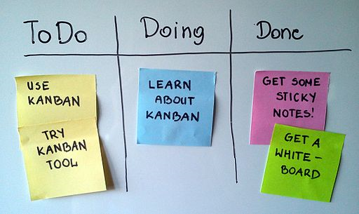

# Projecte 1: Arrenquem

## Taula de continguts

- [Presentació](#presentació)
- [Resultats d'aprenentatge](#resultats-daprenentatge)
- [Introducció a la planificació](#introducció-a-la-planificació)
- [Tasques a realitzar](#tasques-a-realitzar)
- [Com s'avaluarà el projecte?](#com-savaluarà-el-projecte)
- [Materials i recursos](#materials-i-recursos)
- [Temporització](#temporització)

## Presentació

Benvinguts al primer projecte del mòdul `Projecte Intermodular`. En aquest projecte, treballarem en grups per aplicar la metodologia Kanban a un projecte real. L'objectiu és que aprengueu a planificar, organitzar i presentar un projecte utilitzant eines de gestió de tasques.

Com ens organitzarem? Al llarg d'aquestes dues setmanes, us organitzareu en grups i coneixereu la importància de planificar les tasques, sobretot quan es es tracta d'un projecte. Treballarem amb la metodologia Kanban (compte no confondre amb Canvas) i aprendrem a utilitzar l'eina Microsoft 365 Planner per gestionar les tasques del vostre projecte.

Finalment, presentareu el resultat del vostre projecte, ja que la comunicació és una part fonamental de qualsevol activitat professional.

## Resultats d'aprenentatge

RA3. Planifica l'execució de les activitats proposades a la solució plantejada, determinant el pla d'intervenció i elaborant la documentació corresponent.

RA5. Transmet informació amb claredat, de manera ordenada i estructurada.

## Introducció a la planificació

Planificar un projecte informàtic consisteix a definir les tasques, els recursos i la cronologia necessaris per assolir un objectiu concret abans de començar a executar-lo. En el nostre sector, no basta amb posar-se a picar codi o a muntar xarxes immediatament; cal saber exactament quina ruta seguirem.

**Què soluciona la planificació?**

- **Desorganització i caos:** Elimina la improvisació i fa que l'equip es concentri en les tasques realment prioritàries.
- **Desviació de terminis i costos:** Permet detectar retards a temps i reajustar recursos abans que el projecte sigui inviable.
- **Sobrecàrrega de treball:** Distribueix les tasques de manera equilibrada entre els membres de l'equip.
- **Manca de claredat:** Garanteix que tothom sàpiga quines són les seves responsabilitats, les dependències entre tasques i les dates de lliurament.

### L'impacte de planificar: El projecte Polaris

Treballar sense planificació en projectes complexos porta al desastre. Durant la dècada de 1950, l'Armada dels EUA va iniciar el projecte **Polaris** per construir un sistema de míssils balístics llançats des de submarins. Amb més de 3.000 contractistes i desenes de milers de tasques interconnectades, la gestió tradicional basat en la intuïció era un caos absolut.

Per solucionar-ho, van desenvolupar un mètode de planificació per mapejar totes les tasques i les seves dependències temporals. El resultat va ser indiscutible: gràcies a aquesta estructuració, el projecte es va acabar **tres anys abans del previst**. Sense planificació, la manca de coordinació hauria provocat retards incalculables; amb ella, van optimitzar cada fase de treball.

### Introducció a la metodologia Kanban

En el dia a dia de la informàtica utilitzem eines adaptades als canvis constants, com la metodologia àgil **Kanban**. Nascuda al sistema de producció de Toyota i adaptada al desenvolupament de programari i sistemes, Kanban es basa a gestionar el treball de manera molt visual i en temps real.

- **Tauler visual:** El treball es representa en columnes bàsiques com *Pendent (To Do)*, *En procés (In Progress)* i *Finalitzat (Done)*. Cada tasca és una targeta que es mou d'esquerra a dreta.

- **Límit de treball en curs (WIP):** S'imposa un límit màxim de tasques que poden estar a la columna "En procés" al mateix temps. Això evita la multitasca ineficient i els colls d'ampolla.

- **Flux continu:** Els membres de l'equip agafen noves tasques només quan tenen capacitat lliure, garantint un ritme de treball constant i sostenible.

A la dinàmica `Kanban cakes`, veureu com aquesta metodologia ajuda a organitzar el treball de manera eficient i col·laborativa.

## Tasques a realitzar

- Tasca 1  Dinàmica Kanban cake
- Tasca 2: [Kanban grupal](./AA1-Kanban_grupal.md) (RA3)
- Tasca 3: Presentació del projecte (RA5)

## Com s'avaluarà el projecte?

El Kanban grupal i el document de la presentació es valoren de forma conjunta per tot l'equip.

La presentació final del projecte es valora de forma individual per cada membre de l'equip.

La nota final del projecte serà la següent mitjana ponderada de les dues notes anteriors:

$$
Q_{Projecte} = 0,40 \cdot \text{Kanban} + 0,30 \cdot \text{Pr. grupal} + 0,30 \cdot \text{Pr. individual}
$$

## Materials i recursos

- La guia Kanban [castellà (online)](https://kanbanguides.org/es-es/the-kanban-guide/2025.5) i [català (PDF)](https://kanbanguides.org/the-kanban-guide/2020.12/pdf/kanban-guide.v2020.12.ca.pdf)

- [Introducció a Microsoft 365. Recordatori accés i algunes eines útils](https://docs.google.com/presentation/d/1yVXpuDotpB1vI3OaqKtNaFiys4uYFt-M/edit?usp=sharing&ouid=104728425662496836733&rtpof=true&sd=true)

- [Introducció Metodologia Kanban](https://gamma.app/docs/Introduccio-a-la-Metodologia-KANBAN-1ds0a6pkkl5vldo)

- [Exemple de KANBAN en el Món dels Videojocs](https://gamma.app/docs/KANBAN-en-el-Mon-dels-Videojocs-uvv1gz3au0bse9b)

- [Tutorial de Microsoft 365 Planner (5 vídeos). Autor: Squalid via YouTube](https://youtube.com/playlist?list=PL2uOSBfdIiYF7Sjsiw9WVz8f1Q5Dfyt9E&si=PIAHSZ3oQ9tZLysI)

## Temporització

| Data | Activitat |
| --- | --- |
| **15/09/2026** | Presentació del mòdul i del projecte. Formació de grups i comprovació de l'accés a Microsoft 365 Planner. Introducció a l'eina. |
| **18/09/2026** | Introducció a Kanban. Dinàmica `Kanban cakes` i explicació de la metodologia. |
| **21/09/2026** | Activitat Kanban grupal I. |
| **22/09/2026** | Activitat Kanban grupal II. Preparació de la presentació del projecte. |
| **25/09/2026** | Presentació del projecte: presentació del grup; breu explicació de la metodologia Kanban; mostra del Kanban del projecte i explicació de com s'ha organitzat. |
